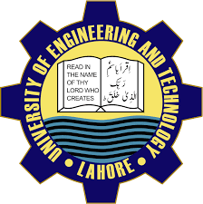

 **Course Project**: *Artificial Intelligence*  
 **Instructor**: Dr. Beenish Ayesha Ikram  
 **Institution**: University of Engineering & Technology (UET), Lahore  

---

# Cold Email Automation  
This project automates **faculty data scraping** from university websites and sends **personalized email campaigns** using **LangChain** and **Groq LLMs**.  
It provides two execution modes:  
1. **Agent-based workflow** (autonomous, LangChain agent-driven)  
2. **Sequential workflow** (step-by-step controlled pipeline)  

---

## Features

- **Faculty Data Scraping**: Extracts faculty details (name, department, qualifications, research interests, email, etc.) from a university site and saves them as CSV.  
- **Personalized Emails**: Generates tailored inquiry emails for each faculty member.  
- **Test Mode**: All emails are redirected to a test inbox for safe verification.  
- **LangChain Integration**: Uses Groq’s `gemma2-9b-it` model for reasoning and workflow execution.  
- **Two Execution Modes**: Choose between **Agent-based** (autonomous) or **Sequential** (controlled) workflows.  

---
